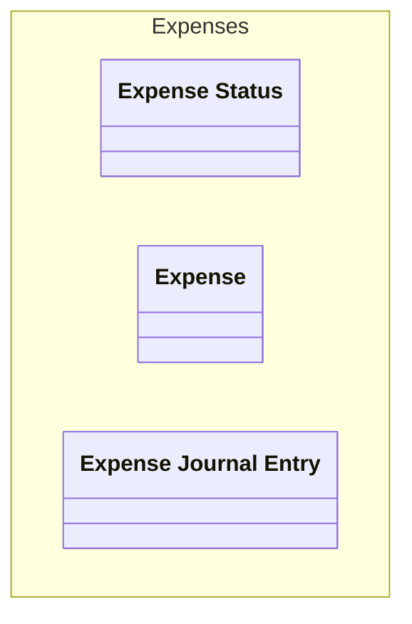

# Expense Status
The status of an expense

## Enum-Values
| Name | Description |
|------|-------------|
| Draft | The expense has been created but not yet submitted |
| Submitted | The expense has been submitted for approval |
| Approved | The expense has been approved |
| Rejected | The expense has been rejected |
| Paid | The expense has been paid |

## Links
1. [Java-File](./java/ExpenseStatus.java)
