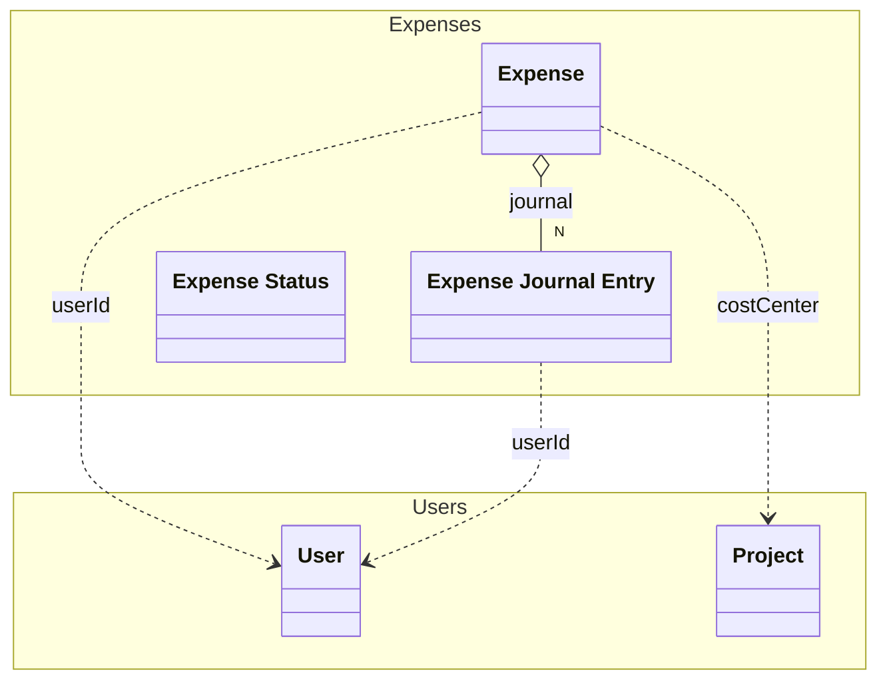

# Expenses
The Expenses

## Schemas

| Name | Type | Description |
|------|-----|-------------|
| [Expense](./Expense.yaml.md) | Aggregate | An expense |
| [Expense Journal Entry](./ExpenseJournal.yaml.md) | Entity | An changed that was made to an expense |
| [Expense Status](./ExpenseStatus.yaml.md) | ValueObject | The status of an expense |

## Links
1. [OpenApiSpec](./Expenses.openapi.yaml)
1. [Java-Files](./java)
