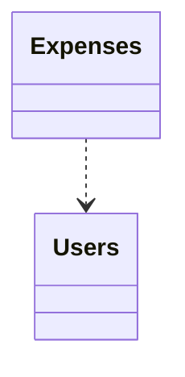

# Test Application
> - [ ] Make sure Markdown works as well
> - [ ] Fix subschemas
This is a example for a domain model. It contains an expenses management system consisting of users, groups, expenses and a lot of other stuff.

## Modules

| Name | Description |
|------|-------------|
| [Expenses](./Expenses/README.md) | The Expenses |
| [Users](./Users/README.md) | The Users of the system and their projects |

## Links
1. [GitHub](https://www.github.com)
