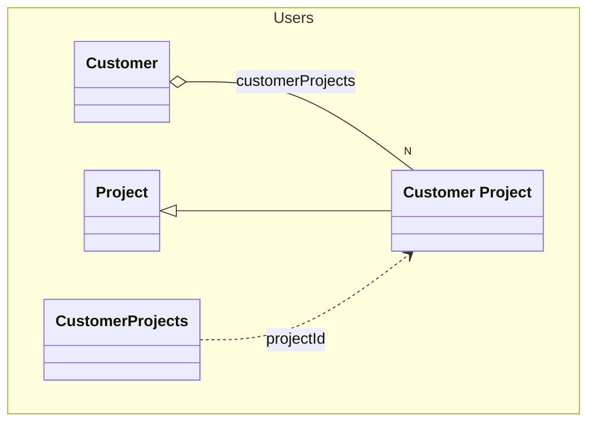

# Customer Project
An customer project

## Properties
| Name | Type | Description |
|------|------|-------------|
| projectId* | string | The id of the project |
| projectName* | string | The name of the project |
| projectDescription* | string | The description of the project |

## Links
1. [Java-File](./java/CustomerProject.java)
