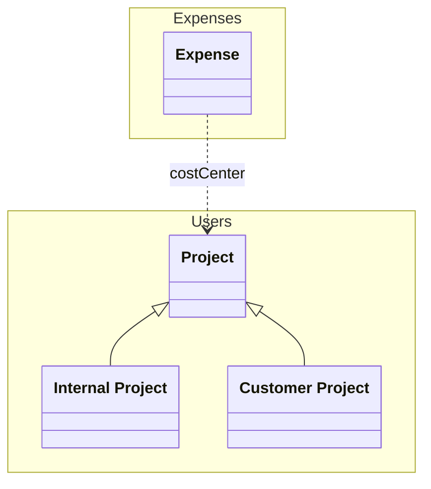

# Project
A project

```mermaid
classDiagram
namespace Users {
  class _Users_Project_yaml["Project"]
  class _Users_InternalProject_yaml["Internal Project"]
  class _Users_CustomerProject_yaml["Customer Project"]
}
namespace Expenses {
  class _Expenses_Expense_yaml["Expense"]
}
_Expenses_Expense_yaml ..> _Users_Project_yaml :costCenter
_Users_Project_yaml <|-- _Users_InternalProject_yaml 
_Users_Project_yaml <|-- _Users_CustomerProject_yaml 
click _Users_Project_yaml href "./Project.yaml.html" "Project"
click _Expenses_Expense_yaml href "./../Expenses/Expense.yaml.html" "Expense"
click _Users_InternalProject_yaml href "./InternalProject.yaml.html" "Internal Project"
click _Users_CustomerProject_yaml href "./CustomerProject.yaml.html" "Customer Project"
```

## One Of
1. [Internal Project](./InternalProject.yaml.md)
1. [Customer Project](./CustomerProject.yaml.md)

## Links
1. [Java-File](./java/Project.java)
