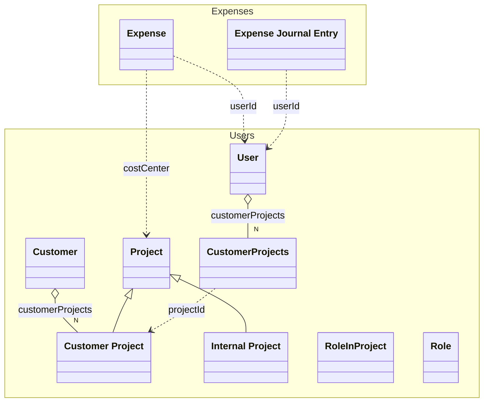

# Users
The Users of the system and their projects

## Schemas

| Name | Type | Description |
|------|-----|-------------|
| [Customer](./Customer.yaml.md) | Aggregate | A customer |
| [Customer Project](./CustomerProject.yaml.md) | Entity | An customer project |
| [Internal Project](./InternalProject.yaml.md) | ReferenceData | An internal project |
| [Project](./Project.yaml.md) | Other | A project |
| [User](./User.yaml.md) | Aggregate | An user of the system |

## Links
1. [OpenApiSpec](./Users.openapi.yaml)
1. [Java-Files](./java)
