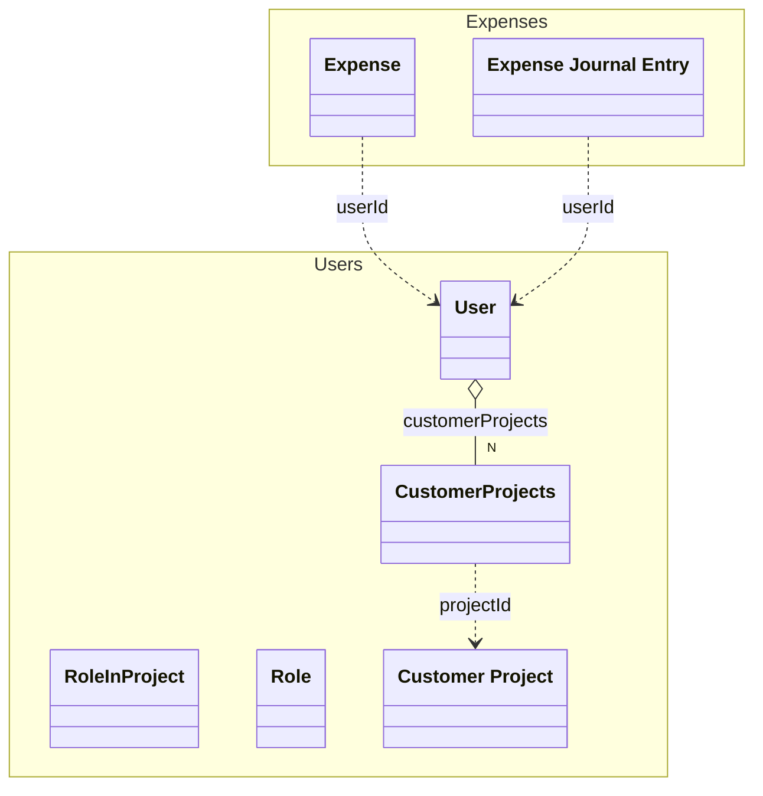

# User
An user of the system


## Properties
| Name | Type | Description |
|------|------|-------------|
| firstName* | string | The first name of the user |
| lastName* | string | The last name of the user |
| email* | email | The email of the user |
| customerProjects | [[CustomerProjects](#CustomerProjects)] |  |
| role | [[Role](#Role)] |  |

## Subschemas
### CustomerProjects (Object)


| Name | Type | Description |
|------|------|-------------|
| projectId | References [Customer Project](./CustomerProject.yaml.md) | The id of the project |
| roleInProject | [[RoleInProject](#RoleInProject)] |  |
### RoleInProject (Enum)


| Name | Description |
|------|-------------|
| admin | Administrator of the project |
| member | Regular member of the project |
| leader | Project-leader, can accept expenses |
### Role (Enum)


| Name | Description |
|------|-------------|
| admin | Administrator |
| user | Regular user |
| finance | Employee in the finance department |

## Examples
```json
{
  "firstName": "John",
  "lastName": "Doe",
  "email": "john.doe@example.com",
  "customerProjects": [
    {
      "projectId": "1",
      "roleInProject": [
        "admin"
      ]
    },
    {
      "projectId": "2",
      "roleInProject": [
        "member"
      ]
    }
  ],
  "role": [
    "admin"
  ]
}
```

## Links
1. [Java-File](./java/User.java)
