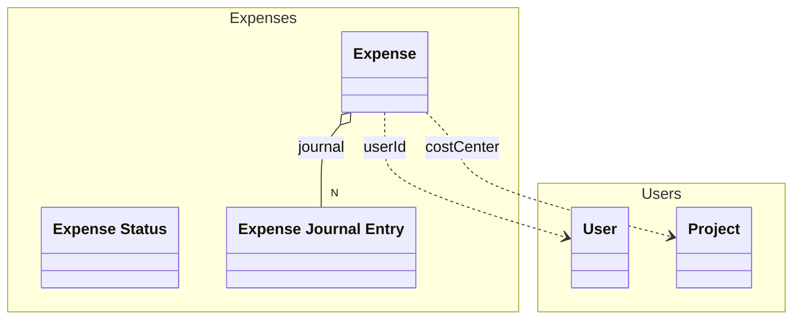

# Expense
An expense


## Properties
| Name | Type | Description |
|------|------|-------------|
| id | string | The unique identifier of the expense |
| date | date | The date of the expense |
| amount | float | The amount of the expense |
| currency | string | The currency of the expense |
| description | string | The description of the expense |
| userId | References [User](./../Users/User.yaml.md) | The user who created the expense |
| costCenter | References [Project](./../Users/Project.yaml.md) | The cost center of the expense |
| status | [Expense Status](./ExpenseStatus.yaml.md) |  |
| journal | [[Expense Journal Entry](./ExpenseJournal.yaml.md)] | The journal of the expense |

## Examples
```json
{
  "id": "exp123",
  "date": "2023-10-01",
  "amount": 200.5,
  "currency": "USD",
  "description": "Office Supplies",
  "userId": "user456",
  "costCenter": "CC789",
  "status": "Submitted",
  "journal": [
    {
      "id": "jrn1",
      "date": "2023-10-01",
      "newStatus": "Submitted",
      "userId": "user456",
      "comment": "Initial submission"
    }
  ]
}
```

## Links
1. [Java-File](./java/Expense.java)
