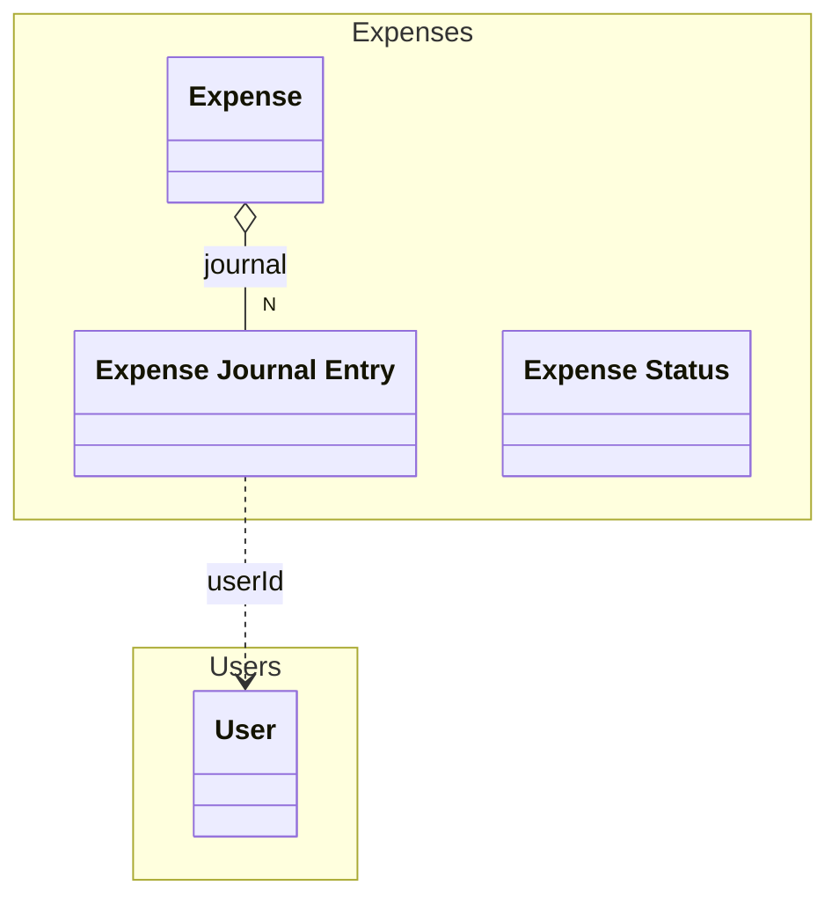

# Expense Journal Entry
An changed that was made to an expense

## Properties
| Name | Type | Description |
|------|------|-------------|
| id* | string | The unique identifier of the expense |
| date* | date | The date of the expense |
| newStatus* | [Expense Status](./ExpenseStatus.yaml.md) |  |
| userId* | References [User](./../Users/User.yaml.md) | The user who changed the expense |
| comment | string | Description of the change |

## Links
1. [Java-File](./java/ExpenseJournal.java)
