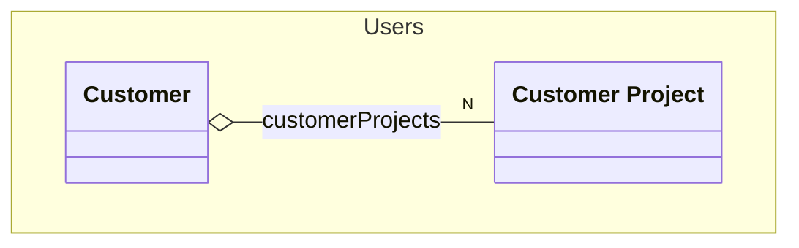

# Customer
A customer


## Properties
| Name | Type | Description |
|------|------|-------------|
| customerId* | string | The id of the customer |
| customerName* | string | The name of the customer |
| customerProjects* | [[Customer Project](./CustomerProject.yaml.md)] |  |
| customerContact* | string | The contact person of the customer |
| customerEmail* | email | The email of the customer |

## Examples
```json
{
  "customerId": "1",
  "customerName": "Customer 1",
  "customerContact": "Contact person 1",
  "customerEmail": "customer@example.com",
  "customerProjects": [
    {
      "projectId": "1",
      "projectName": "Project 1",
      "projectDescription": "Description of project 1"
    },
    {
      "projectId": "2",
      "projectName": "Project 2",
      "projectDescription": "Description of project 2"
    }
  ]
}
```

## Links
1. [Java-File](./java/Customer.java)
