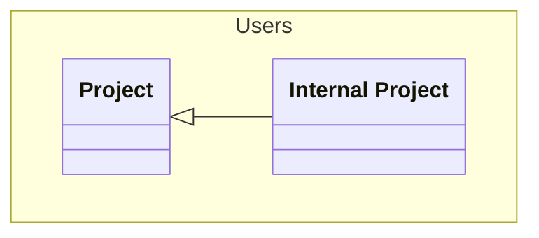

# Internal Project
An internal project


## Properties
| Name | Type | Description |
|------|------|-------------|
| projectId | string | The id of the project |
| projectName | string | The name of the project |
| projectDescription | string | The description of the project |

## Examples
```json
{
  "projectId": "1",
  "projectName": "Project 1",
  "projectDescription": "Description of project 1"
}
```

## Links
1. [Java-File](./java/InternalProject.java)
