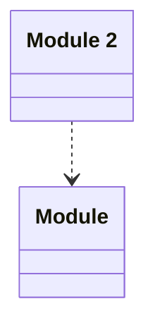

# Test Application

> - A Todo

This is an integration test for the application

## Modules

| Name | Description |
|------|-------------|
| [Module](./Module/README.md) | This is an integration test for the application |
| [Module 2](./Module2/README.md) | This is a 2nd Module |

## Verification Errors
| Type | Description |
|------|-------------|
| WRONG | An error |
| WRONG | Module &#x27;Module&#x27; has 3 validation errors |

## Links
1. [Link](http://www.google.com)
1. [Local-Link](./Module/index.yaml)
