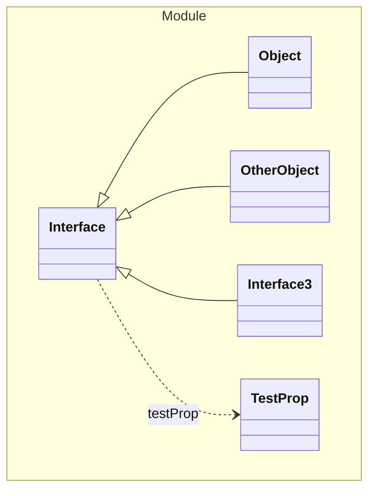

# Interface

This is an interface

## One Of
1. [Object](./Object.yaml.md)
1. [OtherObject](#OtherObject)
1. [Interface3](#Interface3)

## Properties
| Name | Type | Description |
|------|------|-------------|
| testProp | [TestProp](#TestProp) |  |

## Subschemas
### TestProp (Enum)
This is a test property

| Name | Description |
|------|-------------|
| Test | Test description |
| Test2 | Test2 description |

### Interface3 (Enum)

| Name | Description |
|------|-------------|
| Test | Test description |
| Test2 | Test2 description |

### OtherObject (Object)

| Name | Type | Description |
|------|------|-------------|
| id | String |  |
| wrongType | String |  |
| constV | String "Test" |  |
| constB | Boolean true |  |

## Verification Errors
| Type | Description |
|------|-------------|
| WRONG | Interface &#x27;com.example.module.model.Interface&#x27; is invalid: This is suppose to be an interface but is a &#x27;class&#x27;&#x27; |
| NOT_IN_DOMAIN_MODEL | Value &#x27;Test3&#x27; should not exist in enum &#x27;com.example.module.model.InterfaceInterface3&#x27; |
| MISSING_IN_IMPLEMENTATION | Property &#x27;constV&#x27; is missing in class &#x27;com.example.module.model.InterfaceOtherObject&#x27; |
| MISSING_IN_IMPLEMENTATION | Property &#x27;constB&#x27; is missing in class &#x27;com.example.module.model.InterfaceOtherObject&#x27; |
| WRONG | Property &#x27;wrongType&#x27; has type &#x27;Integer&#x27; in class &#x27;com.example.module.model.InterfaceOtherObject&#x27; but should have type &#x27;String&#x27; |
| NOT_IN_DOMAIN_MODEL | Property &#x27;wrongProperty&#x27; should not exist in class &#x27;com.example.module.model.InterfaceOtherObject&#x27; |

## Links
1. [Java-File](./java/Interface.java)
1. [Java-File (TestProp)](./java/InterfaceTestProp.java)
1. [Java-File (Interface3)](./java/InterfaceInterface3.java)
1. [Java-File (OtherObject)](./java/InterfaceOtherObject.java)
