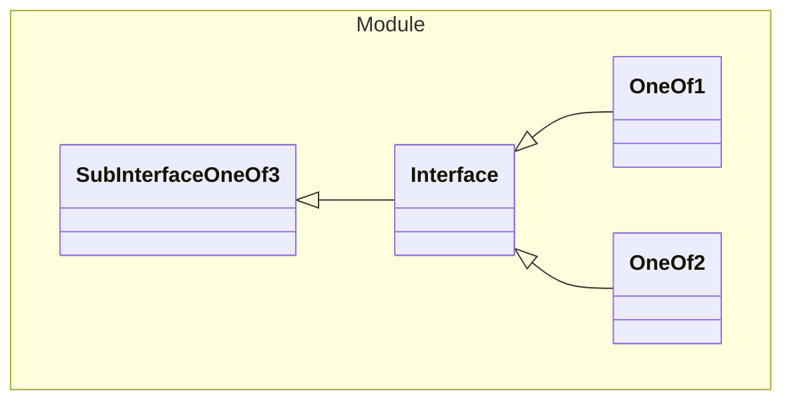

# Interface

An interface

## One Of
1. [OneOf1](#OneOf1)
1. [OneOf2](#OneOf2)

## Properties
| Property | Type | Description |
|------|------|-------------|
| kind* | String |  |

## Subschemas
### Class OneOf2

| Property | Type | Description |
|------|------|-------------|
| kind* | String "INSIDE2" |  |
| key | String |  |
| value | String |  |
| (other) | Integer | Additional Properties |

### Class OneOf1

| Property | Type | Description |
|------|------|-------------|
| kind* | String "INSIDE1" |  |
| name | String |  |

## Verification Errors
| Type | Description |
|------|-------------|
| WRONG | Interface &#x27;com.example.module.model.Interface&#x27; is invalid: This is suppose to be an interface but is a &#x27;class&#x27; |

## Links
1. [Java-File](./java/Interface.java)
1. [Java-File (OneOf2)](./java/InterfaceOneOf2.java)
1. [Java-File (OneOf1)](./java/InterfaceOneOf1.java)
