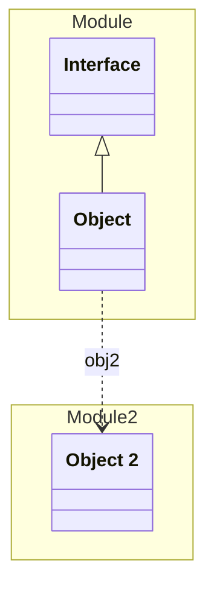

# Object

This is an integration test for the application


## Examples
```json
{
  "ids": [
    "1",
    "2"
  ],
  "name": "Test",
  "other": "False"
}
```


## Properties
| Name | Type | Description |
|------|------|-------------|
| ids | [String] |  |
| name | String |  |
| obj2 | [Object 2](../Module2/Object2.yaml.md) |  |
| (other) | * | Additional Properties |


## Links
1. [Java-File](./java/Object.java)
