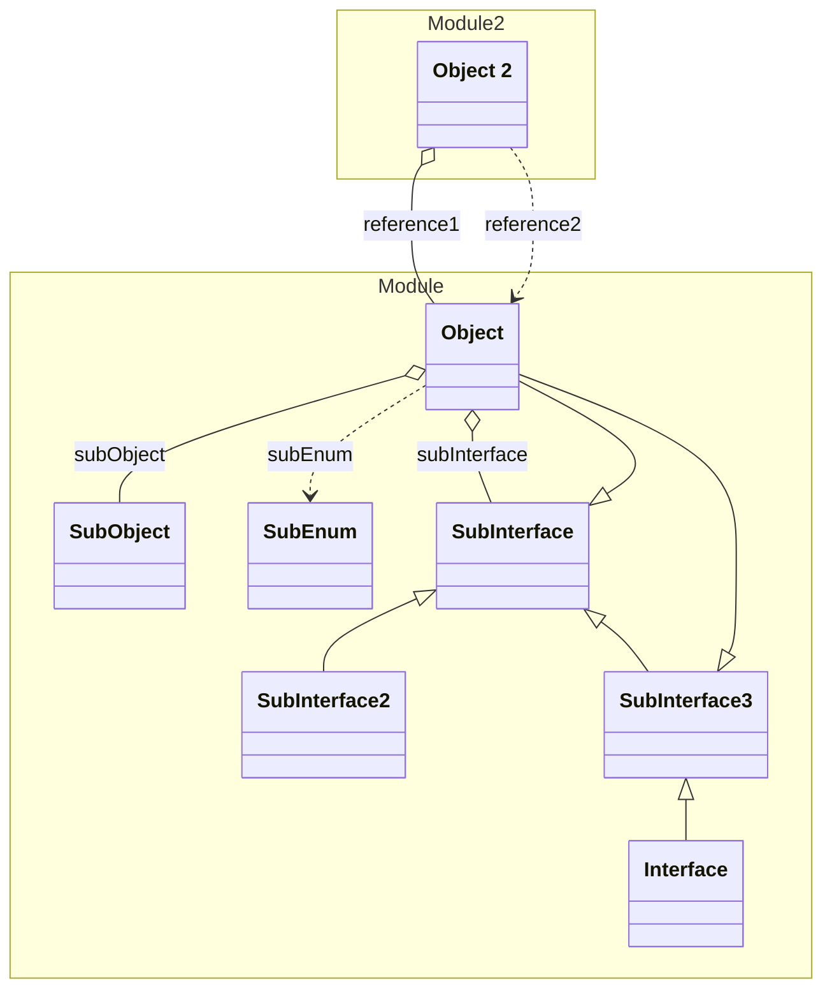

# Object


A simple object



## Properties
| Name | Type | Description |
|------|------|-------------|
| id* | String |  |
| name* | String |  |
| subObject | [SubObject](#SubObject) |  |
| subEnum | [SubEnum](#SubEnum) |  |
| subInterface | [SubInterface](#SubInterface) |  |

## Examples
```json
{
  "id": "1",
  "name": "Test"
}
```


## Subschemas
### SubObject


#### Properties
| Name | Type | Description |
|------|------|-------------|
| key | String |  |
| value | String |  |
### SubEnum


#### Enum-Values
| Name | Description |
|------|-------------|
| A | Value A |
| B | Value B |

### SubInterface


#### One Of
1. [Object](./)
1. [SubInterface2](#SubInterface2)
1. [SubInterface3](#SubInterface3)


#### Properties
| Name | Type | Description |
|------|------|-------------|
| key | String |  |
| value | String |  |
### SubInterface2


#### Properties
| Name | Type | Description |
|------|------|-------------|
| key | String |  |
| value | String |  |
### SubInterface3


#### One Of
1. [Object](./)
1. [Interface](./Interface.yml.md)


## Links
1. [Java-File](./java/Object.java)
1. [Java-File (SubObject)](./java/ObjectSubObject.java)
1. [Java-File (SubEnum)](./java/ObjectSubEnum.java)
1. [Java-File (SubInterface)](./java/ObjectSubInterface.java)
1. [Java-File (SubInterface2)](./java/ObjectSubInterface2.java)
1. [Java-File (SubInterface3)](./java/ObjectSubInterface3.java)
