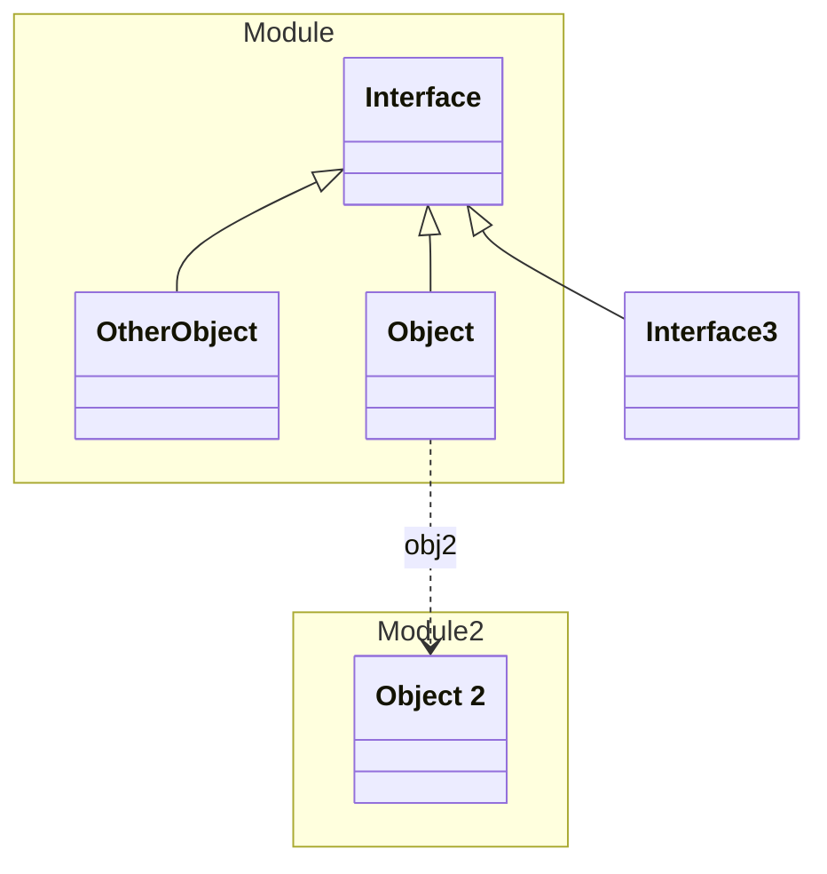

# Module

This is a first module

## Schemas

| Name | Type | Description |
|------|-----|-------------|
| [Interface](./Interface.yaml.md) | Other | This is an interface |
| [Object](./Object.yaml.md) | Aggregate | This is an integration test for the application |

## Verification Errors
| Type | Description |
|------|-------------|
| WRONG | Schema &#x27;Interface&#x27; has 6 validation errors |

## Links
1. [This is an existing link](https://example.com)
1. [Java-Files](./java)
