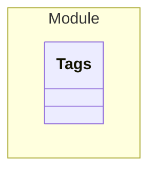

# Tags

> - A Todo

An example for tags etc.

## Properties
| Property | Type | Description |
|------|------|-------------|
| id | String |  |

## Verification Errors
| Type | Description |
|------|-------------|
| WRONG | An error |
| MISSING_IN_IMPLEMENTATION | &#x27;com.example.module.model.Tags&#x27; should exist but is missing in the implementation |

## Links
1. [Link](http://www.google.com)
1. [Local-Link](./Module/index.yaml)
1. [Java-File](./java/Tags.java)
