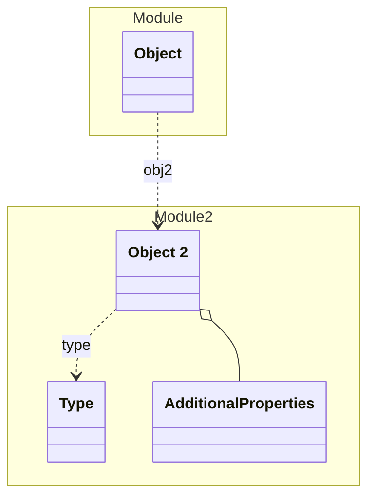

# Object 2


An Object in Module 2


## Examples
```json
{
  "id": "1",
  "type": "type1",
  "additional": {
    "key": "key",
    "value": "value"
  }
}
```


## Properties
| Name | Type | Description |
|------|------|-------------|
| id | String |  |
| type | [Type](#Type) |  |
| (other) | [AdditionalProperties](#AdditionalProperties) | Additional Properties |

## Subschemas
### Type (Enum)


| Name | Description |
|------|-------------|
| type1 | Description of type1 |
| type2 | Description of type2 |

### AdditionalProperties (Object)


| Name | Type | Description |
|------|------|-------------|
| key | String |  |
| value | String |  |

## Verification Errors
| Type | Description |
|------|-------------|
| MISSING_IN_IMPLEMENTATION | &#x27;com.example.module2.model.Object2&#x27; should exist but is missing in the implementation |
| MISSING_IN_IMPLEMENTATION | &#x27;com.example.module2.model.Object2Type&#x27; should exist but is missing in the implementation |
| MISSING_IN_IMPLEMENTATION | &#x27;com.example.module2.model.Object2AdditionalProperties&#x27; should exist but is missing in the implementation |

## Links
1. [Java-File](./java/Object2.java)
1. [Java-File (Type)](./java/Object2Type.java)
1. [Java-File (AdditionalProperties)](./java/Object2AdditionalProperties.java)
