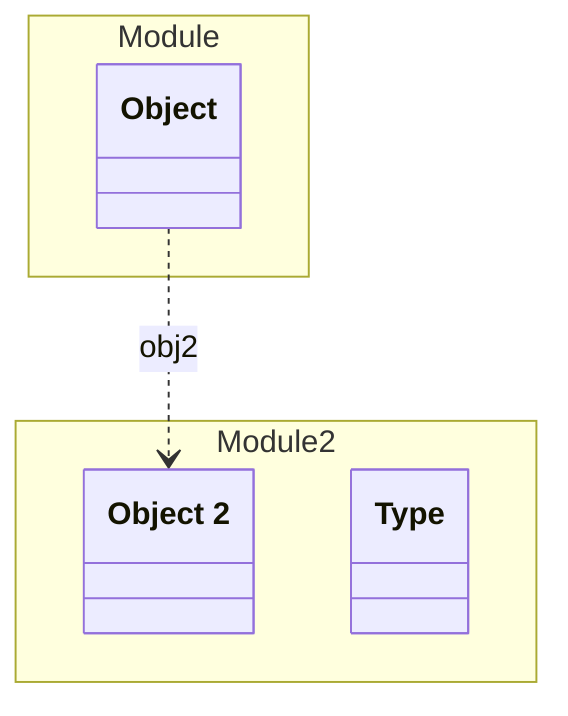

# Object 2
> - [ ] 2 validation errors
An Object in Module 2

## Properties
| Name | Type | Description |
|------|------|-------------|
| id | string |  |
| type | [Type](#Type) |  |

## Subschemas
### Type (Enum)

| Name | Description |
|------|-------------|
| type1 | Description of type1 |
| type2 | Description of type2 |

## Verification Errors
| Type | Description |
|------|-------------|
| MISSING_IN_IMPLEMENTATION | &#x27;com.example.module2.model.Object2&#x27; should exist but is missing in the implementation |
| MISSING_IN_IMPLEMENTATION | &#x27;com.example.module2.model.Object2Type&#x27; should exist but is missing in the implementation |

## Links
1. [Java-File](./java/Object2.java)
1. [Java-File (Type)](./java/Object2Type.java)
