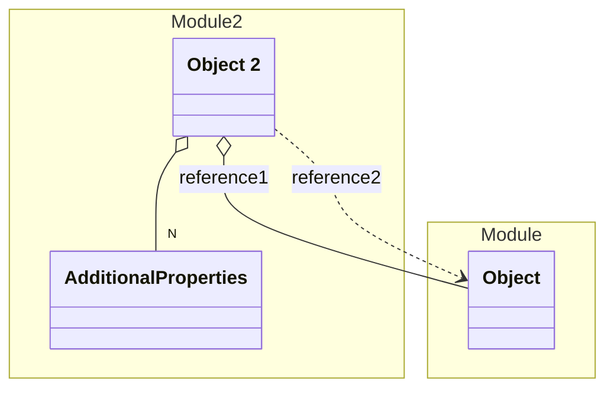

# Module 2

This is a 2nd Module

## Schemas

| Name | Type | Description |
|------|-----|-------------|
| [Object 2](./Object2.yaml.md) | Aggregate | An Object in Module 2 |

## Links
1. [Java-Files](./java)
