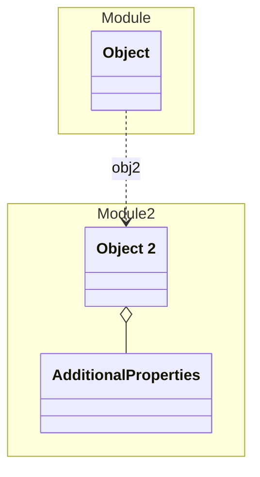

# Module 2

This is a 2nd Module

## Schemas

| Name | Type | Description |
|------|-----|-------------|
| [Object 2](./Object2.yaml.md) | Other | An Object in Module 2 |

## Verification Errors
| Type | Description |
|------|-------------|
| WRONG | Schema &#x27;Object 2&#x27; has 3 validation errors |

## Links
1. [Java-Files](./java)
