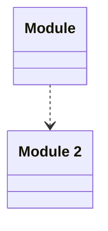

# Test Application
> - [ ] 2 validation errors
This is an integration test for the application

## Modules

| Name | Description |
|------|-------------|
| [Module](./Module/README.md) | This is a first module |
| [Module 2](./Module2/README.md) | This is a 2nd Module |

## Verification Errors
| Type | Description |
|------|-------------|
| WRONG | Module &#x27;Module&#x27; has 1 java validation errors |
| WRONG | Module &#x27;Module 2&#x27; has 1 java validation errors |

