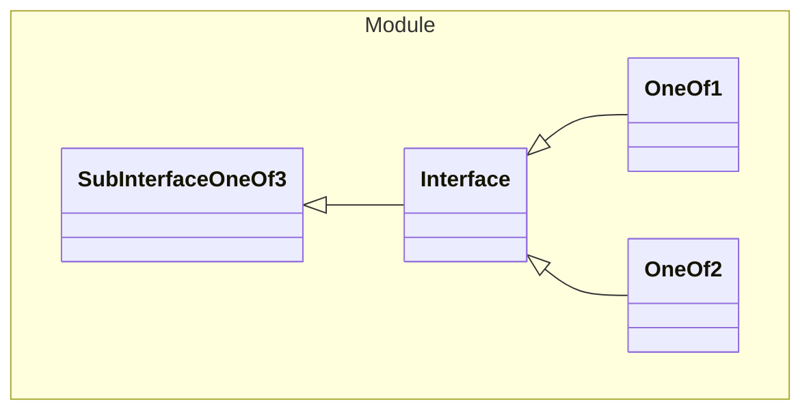

# Interface

An interface

## One Of
1. [OneOf1](#OneOf1)
1. [OneOf2](#OneOf2)

## Properties
| Property | Type | Description |
|------|------|-------------|
| kind* | String |  |

## Subschemas
### Class OneOf2

| Property | Type | Description |
|------|------|-------------|
| kind* | String "INSIDE2" |  |
| key | String |  |
| value | String |  |
| (other) | Integer | Additional Properties |

### Class OneOf1

| Property | Type | Description |
|------|------|-------------|
| kind* | String "INSIDE1" |  |
| name | String |  |

