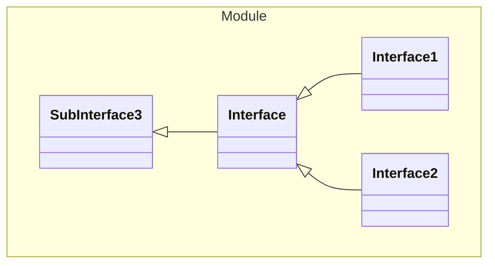

# Interface

An interface

## One Of
1. [Interface1](#Interface1)
1. [Interface2](#Interface2)

## Properties
| Name | Type | Description |
|------|------|-------------|
| kind* | String |  |

## Subschemas
### Interface1

#### Properties
| Name | Type | Description |
|------|------|-------------|
| kind* | String "INSIDE1" |  |
| name | String |  |
### Interface2

#### Properties
| Name | Type | Description |
|------|------|-------------|
| kind* | String "INSIDE2" |  |
| key | String |  |
| value | String |  |

