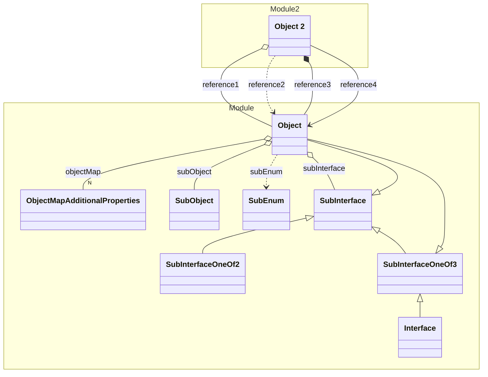

# Object


A simple object



## Properties
| Property | Type | Description |
|------|------|-------------|
| id* | String |  |
| name* | String |  |
| intMap | {Float} |  |
| objectMap | {[ObjectMapAdditionalProperties](#ObjectMapAdditionalProperties)} |  |
| subObject | [SubObject](#SubObject) |  |
| subEnum | [SubEnum](#SubEnum) |  |
| subInterface | [SubInterface](#SubInterface) |  |
| (other) | Integer | Additional Properties |

## Examples
```json
{
  "id": "1",
  "name": "Test"
}
```


## Subschemas
### Interface SubInterface


| Property | Type | Description |
|------|------|-------------|
| key | String |  |
| value | String |  |

Implemented by
1. [Object](./)
1. [SubInterfaceOneOf2](#SubInterfaceOneOf2)
1. [SubInterfaceOneOf3](#SubInterfaceOneOf3)
### Interface SubInterfaceOneOf3


Implemented by
1. [Object](./)
1. [Interface](./Interface.yml.md)
### Class SubInterfaceOneOf2


| Property | Type | Description |
|------|------|-------------|
| key | String |  |
| value | String |  |

### Enum SubEnum

| Enum | Description |
|------|-------------|
| A | Value A |
| B | Value B |


### Class SubObject


| Property | Type | Description |
|------|------|-------------|
| key | String |  |
| value | String |  |

### Class ObjectMapAdditionalProperties


| Property | Type | Description |
|------|------|-------------|
| key | String |  |
| value | String |  |


