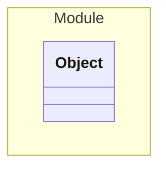

# Object

This is an integration test for the application


## Examples
```json
{
  "id": "1",
  "name": "Test"
}
```


## Properties
| Name | Type | Description |
|------|------|-------------|
| id | String |  |
| name | String |  |
| (other) | Integer | Additional Properties |


