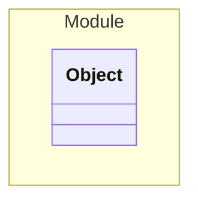

# Module

This is an integration test for the application

## Schemas

| Name | Type | Description |
|------|-----|-------------|
| [Object](./Object.yaml.md) | Aggregate | This is an integration test for the application |

