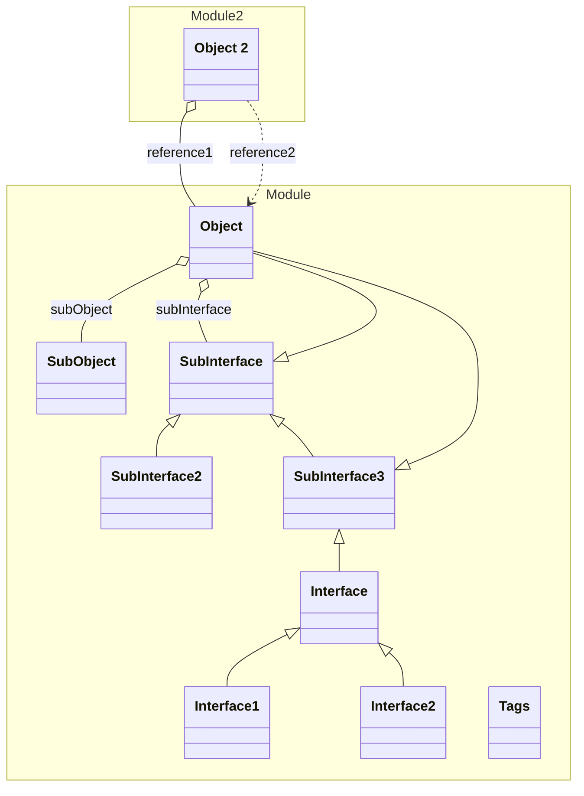

# Module

> - A Todo

This is an integration test for the application

## Schemas

| Name | Type | Description |
|------|-----|-------------|
| [Interface](./Interface.yml.md) | Other | An interface |
| [Object](./Object.yaml.md) | Entity | A simple object |
| [Tags](./Tags.yaml.md) | ValueObject | An example for tags etc. |

## Verification Errors
| Type | Description |
|------|-------------|
| WRONG | An error |
| WRONG | Schema &#x27;Tags&#x27; has 1 validation error |

## Links
1. [Link](http://www.google.com)
1. [Local-Link](./Module/index.yaml)
