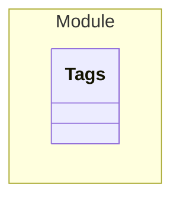

# Tags

> - A Todo

An example for tags etc.

## Properties
| Name | Type | Description |
|------|------|-------------|
| id | String |  |

## Verification Errors
| Type | Description |
|------|-------------|
| WRONG | An error |

## Links
1. [Link](http://www.google.com)
1. [Local-Link](./Module/index.yaml)
