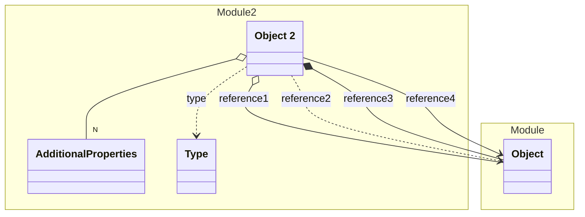

# Object 2


An Object in Module 2



## Properties
| Property | Type | Description |
|------|------|-------------|
| id | String |  |
| type | [Type](#Type) |  |
| reference1 | [Object](../Module/Object.yaml.md) |  |
| reference2 | References [Object](../Module/Object.yaml.md) |  |
| reference3 | [Object](../Module/Object.yaml.md) |  |
| reference4 | [Object](../Module/Object.yaml.md) |  |
| (other) | [AdditionalProperties](#AdditionalProperties) | Additional Properties |

## Examples
```json
{
  "id": "1",
  "type": "type1",
  "additional": {
    "key": "key",
    "value": "value"
  }
}
```


## Subschemas
### Class AdditionalProperties


| Property | Type | Description |
|------|------|-------------|
| key | String |  |
| value | String |  |

### Enum Type

| Enum | Description |
|------|-------------|
| type1 | Description of type1 |
| type2 | Description of type2 |


