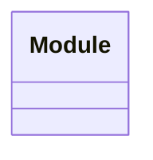

# Test Application

This is an integration test for the application

## Modules

| Name | Description |
|------|-------------|
| [Module](./Module/README.md) | This is an integration test for the application |

